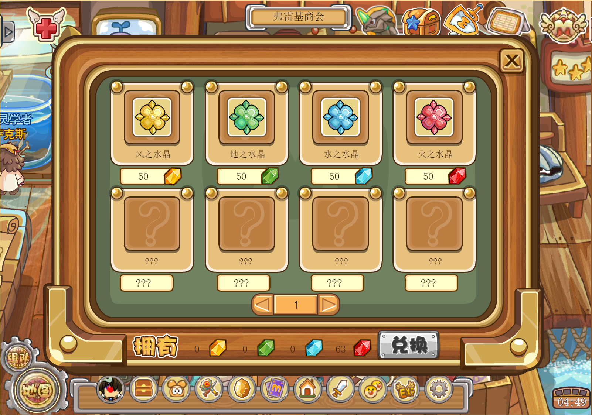
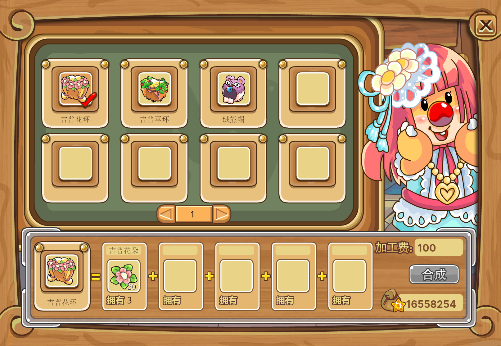
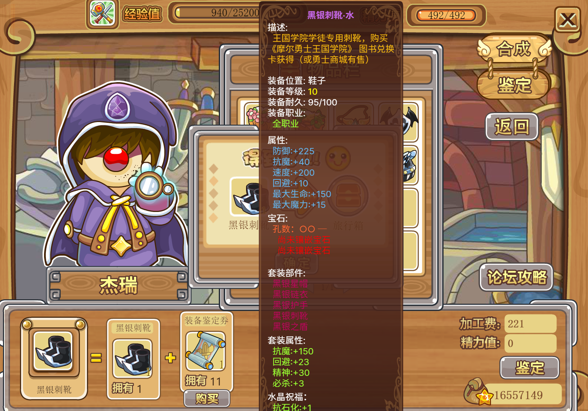
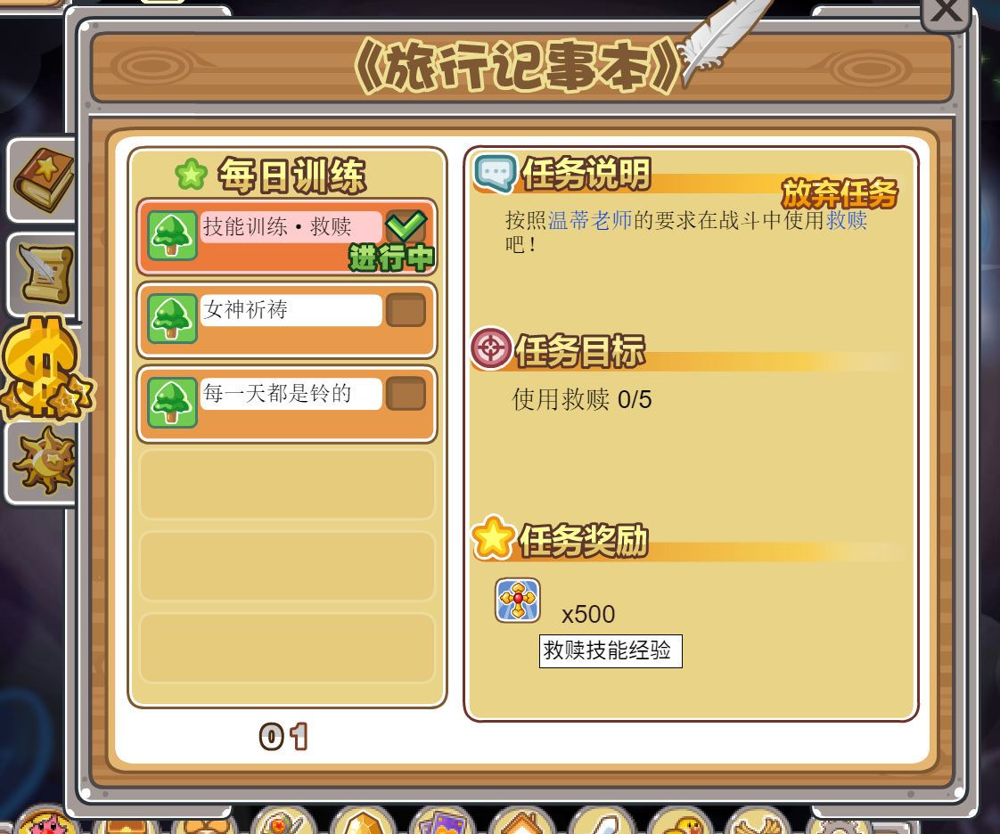
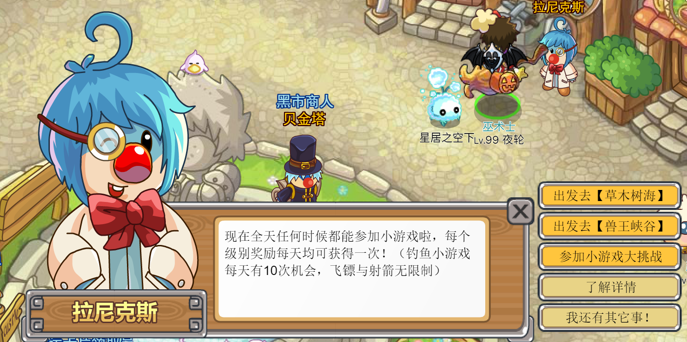

# 摩尔勇士官服指南

ver 2020.4.11

摩尔王国

我们从地下来到地面

建筑爱与勇气的国度

阳光·快乐·永远

---

## 注意

***使用外挂、脚本、加速器、WPE 等一切修改游戏数据的程序将会导致玩家永久失去游戏资格***

游戏本体处于测试阶段，游戏测试资格需到 [米饭 app](http://mifan.61.com/) 登记以申请

关服后以前的数据已全部清除，现在登录将重新注册用户

游戏**剧情**无后续更新，游戏**活动**将不定期举行

欢迎回到千年以前的格历尔大陆

---

## 目录

- [进入游戏](#进入游戏)
- [bug 相关](#bug相关)
  - [bug，抑或是特性](#bug，抑或是特性)
- [活动相关](#活动相关)
  - [福利](#福利)
  - [限时活动](#限时活动)
- [职业相关](#职业相关)
  - [职业的选择](#职业的选择)
  - [剑士简介](#剑士简介)
  - [弓箭手简介](#弓箭手简介)
  - [魔法师简介](#魔法师简介)
  - [传教士简介](#传教士简介)
  - [忍者简介](#忍者简介)
  - [简介·狂战士](#简介·狂战士)
  - [简介·巫术师](#简介·巫术师)
  - [简介·圣言使](#简介·圣言使)
  - [简介·黑魔导士](#简介·黑魔导士)
- [装备相关](##装备相关)
  - [推荐战斗装备](#推荐战斗装备)
  - [装备掉落地点](#装备掉落地点)
  - [时装与坐骑](#时装与坐骑)
  - [锻造](#锻造)
  - [强化](#强化)
- [战斗与升级相关](##战斗与升级相关)
  - [最速升级推荐](#最速升级推荐)
  - [努力值与努力值的分配](#努力值与努力值的分配)
  - [种族相克关系](#种族相克关系)
  - [变身卡](#变身卡)
  - [水晶](#水晶)
  - [技能的学习与升级](#技能的学习与升级)
- [精灵相关](#精灵相关)
  - [推荐的精灵](#推荐的精灵)
  - [转生](#转生)
  - [精灵对对碰](#精灵对对碰)
  - [精灵别称](#精灵别称)
  - [一些杂谈](#一些杂谈)
- [任务相关](#任务相关)
  - [主线任务](#主线任务)
  - [运营 / 赏金 / 日常任务](#运营/赏金/日常任务)
- [玄学相关](#玄学相关)
- [杂谈相关](#杂谈相关)
- [后记](#后记)
  - [2020.3.22](#2020.3.22)
  - [2020.3.25](#2020.3.25)
  - [2020.4.11](#2020.4.11)
- [附表1：常用公式](#附表1：常用公式)
- [Ref](#Ref)

---

## 进入游戏

请见 B 站专栏[【摩尔勇士】申请游戏白名单并进入游戏教学](https://www.bilibili.com/read/cv5031120)。

---

## bug相关

***请仔细阅读本章内容，以避免以下破坏游戏体验的情况出现！！！***

本章主要讲述自摩勇重启以来，游戏里存在的 bug。

- 穿着部分装备时会无法进入战斗页面；
  - 已知的装备有 25 级的疾风法袍、金牛座部分装备、狮子座部分装备；
  - 解决方法为穿时装 / 使用变身卡。
- 部分任务无法完成；
  - 无解决方案；
  - 已知的无法完成的任务均不影响主线剧情与正常升级，所以可以忽略这些任务。
- 转生后使用精灵初始重组丸 / 精灵成长重组丸，转生获得的额外成长和努力值会消失；
  - 无解决方案；
  - 避免方案为刷出自己满意的成长和初始值后再开始转生。
- 精灵在 7 转的第 97 级、8 转的第 90 级、9 转的第 84 级、10 转的第 78 级的时候，若进入战斗，则升级所需经验会增到上亿，且每场战斗后经验均会清零；[^2]
  - 解决方案为不让该精灵出战，通过经验树为其分配经验，将经验条填满升级；
  - 避免方案为达到该等级后不让该精灵出战，只通过经验树为其分配经验。
    - 也可托管在精灵坊。但是速度过慢，十分不值。
- 在活动服获得的高成长值精灵，若在普通服使用精灵初始重组丸 / 精灵成长重组丸，会使成长值降回原始的低成长值；
  - 解决方法为进入活动服，使用上述道具重新洗成长即可；
  - 避免方法为不要在普通服务器使用上述道具。
- 进入与离开斯巴鲁洞穴时，画面会变黑并卡住；
  - 解决方法为刷新。
- 波波尔蛋无法孵化；
  - 无解决方案。
- 迷之钥匙（能开启修炼之域宝箱的钥匙）无法使用；
  - 无解决方案。
- 狂战士的 bug 斩；
  - 劲透斩：在不带精灵的情况下，人物对目标使用劲透斩后，再对目标（同一或其他目标）进行普通攻击，此时普通攻击会触发劲透斩的伤害倍率。该 bug 最直接的后果就是无论目标是否防御，都会受到伤害。
  - 迷返斩：在不带精灵的情况下，人物对目标使用迷返斩后，再对目标（同一或其他目标）进行普通攻击，此时普通攻击会触发迷返斩的伤害倍率。
  - **随时都有被修复的可能。切勿依赖。**
- 回击与护卫：回击 / 护卫的实际攻击效果只与攻击者的技能等级有关，与回击 / 护卫本身的技能等级完全无关；

### bug，抑或是特性

- 转生时，后天学习的技能有一定几率会替换先天学习技能；[^1]
  - 无解决方案；
  - 会替换的技能为精灵先天可以学习到的技能；
    - 例如，一只雪绒草的先天技能为「缠身藤蔓」和「吸血攻击」，后天学习了「狂击」。由于「狂击」也是雪绒草先天能学习到的技能之一（只是这只没学到），转生时「狂击」有可能会把「缠身藤蔓」和「吸血攻击」中的一个顶替掉；
    - 例如，一只雪绒草通过种族灵药将先天的技能替换为了「治愈花环」和「缠身藤蔓」，又后天学习了「狂击」。由于「治愈花环」和「缠身藤蔓」都在雪绒草的先天技能列表里，所以即使这两个技能是后天使用灵药学习的，转生时狂击依旧有可能会把它们顶替掉；
    - 例如，由于斯巴鲁的先天技能列表里不存在「狂击」，斯巴鲁顶「狂击」是不存在的；
    - 有概率“顶一送一”。例如，一只草莓蜂通过种族灵药学习了「毒爆术」和「弱点透析」，后天学习了「狂击」。但是转生时，除了有几率出现“「狂击」顶替掉「毒爆术」成为先天技能，「弱点透析」保留”、“「狂击」顶替掉「弱点透析」成为先天技能，「毒爆术」保留”的情况以外，还有几率出现“「狂击」和 后天并未学习，但属于草莓蜂该种族能学习到的先天技能「吸血攻击」同时顶替掉「毒爆术」和「弱点透析」成为先天技能”的情况；
  - 避免方案为在决定停止转生之前，不学习后天技能；或者学习一堆先天技能里没有的技能（比如物理系宠物学满魔法技能）；
  - 每一转都有几率触发；
  - 可以利用此项，将想要的后天技能顶替为先天技能。

---

## 活动相关

本章将简略概述摩勇现版本的福利与活动。

### 福利

- 精灵经验树每天都会有 50,000,000 点经验；
- 砸罐子可得 1 级生命石。特定地点会有特定物品。所有的罐子都有几率砸出精品蛋或金羊狼（定点的物品也有几率被蛋替换掉）（蛋列表可在摩尔王国西街「空无一物先生」处查看）；

表1 定点罐子的物品与数量列表

| 地点 | 物品 | 数量下限 | 数量上限 | 备注 |
| - | - | :-: | :-: | - |
| 皮皮克克家 | 初级合成石 | 12 | 12 | 初中高随机 |
| 皮皮克克家 | 中级合成石 | 6 | 6 | 初中高随机 |
| 皮皮克克家 | 高级合成石 | 2 | 2 | 初中高随机 |
| 村长家 | 精力果Ⅱ |10|10||
| 勇士广场 | 精致金刚石 |5|20||
| 勇士广场 | 技能经验笔记 |5|20||
| 勇士广场 | 超级星豆袋 |5|20||
| 勇士广场 | 装备鉴定券 |5|20||
| 装备店 | 自动回血秘药 |3|9||
| 道具店 | 自动回蓝秘药 |3|9||
| 王国南街 | 强效万用闪灵胶片 |5|20||
| 王国南街 | 无敌万用闪灵胶片 |5|20||
| 皮克斯研究所 | 摩尔配点重置丸 |2|2||
| 王国西街 | 精灵种族技能灵药 |5|20||
| 王国东街 | 精灵初始重组丸 |5|20||
| 王国东街 | 精灵成长重组丸 |5|20||

### 限时活动

每天 12:00 ~ 15:00、18:00 ~ 21:00 开放活动服务器，名字叫做“活动服务器”。无进入服务器限制。活动区域所有怪物等级均为 99 级，建议低等级玩家找高等级玩家组队。

活动服的掉落奖励如下：

- 格历尔平原全区：焰鳞小白龙精灵蛋、魔王密钥、黑银套装大礼包、6 级宝石（仅限*普通怪*）
  - 怪盗迪迪拉：生命石
  - 假面吉吉帕：魔法石
  - 拉拉美：防护石
  - 草莓蜂：力量石
  - 迷唇爱丝：智慧石
  - 怪盗戈戈拉：消魔石
  - 盯眼蝠：活络石
  - 迷眼蝠：清凉石
  - 王冠卡西卡：圣光石
- 锁修塔全楼层（所有的精灵都会被替换为金甲剑魂）：勇气勋章（用于兑换星座装备）、6 级宝石（除生命石、魔法石、消魔石）
- 草木树海挑战骷髅王
  - 初级：吉普豆叶精品蛋
  - 中级：雪绒草精灵蛋、独眼树藤怪精灵蛋
  - 高级：吉普豆花·改精灵蛋、吉普豆叶·改精灵蛋

活动服的精灵增益如下：

表2 活动服精灵增益列表

| 精灵 | 成长值上限 | 水晶属性 |
| ------ | :------: | :------: |
| 草莓蜂 | 170 | 地 10 水 10 火 10 风 10 |
| 雪绒草 | 189 | 地 10 水 15 火 5 风 5 |
| 独眼树藤怪 | 198 | 地 10 水 15 火 5 风 5 |
| 王冠卡西卡 | 180 | 地 10 水 10 火 10 风 10 |
| 拉拉美 | 170 | 地 10 水 10 火 10 风 10 |
| 曼陀萝卜 | 180 | 地 10 水 10 火 10 风 10 |
| 吉普豆叶 | 174 | 地 15 水 5 火 5 风 5 |
| 吉普豆叶·改 | 182 | 地 5 水 5 火 15 风 10 |
| 吉普豆花 | 暂无数据 | 暂无数据 |
| 吉普豆花·改 | 181 | 地 15 水 10 火 5 风 5 |
| 怪盗戈戈拉 | 180 | 地 10 水 10 火 10 风 10 |

---

## 职业相关

本章将介绍并简略评价摩尔勇士中的九大职业。

所列技能均为该职业的特色技能。如无特别说明，所列技能的数据均为 7 级的数据。

加点问题暂略过不谈，因为本文只是一个指引新手到达 99 级、装备与精灵达到毕业标准的指南，在这段时间内用系统推荐的加点即可。

### 职业的选择

> ……不用去太在意各个职业强弱的平衡的问题，虽然做不到绝对的职业平衡，但也不可能会让某个职业占据顶端位置。大家尽量选自己一眼相中的那个职业吧，毕竟对游戏的热情才是第一位的（无关成败输赢，大家基本都是成年人，别像小孩子一样争来争去了😁）。
>
>——迷雾
>
> 稍稍讲一下关于选择哪一个职业、35 级以后是否要转职的问题。这个问题就和现实世界的职业选择一样，是没有正确答案的。我给新手的建议就是：遵从你内心的选择。就算你选了一个当前公认最强的职业，缺乏对该职业的正确认识、加点方向、练习、战术与随机应变能力，在竞技场里还是会被吊打的。所以，不妨选一个自己最喜欢的职业，然后踏上旅程吧。
>
>——夜轮

### 剑士简介

> 拿剑是为了保护重要的人。
>
> ——剑士导师  杰森

典型的物理系近身攻击角色，拥有丰富的近身攻击与防御技能，尤以提速提攻的「先制」最为突出。

没有远程攻击技能。十分看中命中。技能只能攻击到前排角色。

由于现版本角色技能锁定在 7 级，而物理系精灵的技能普遍都在 8 级，先天技能更是高达 10 级；再加上部分精灵极高的成长，这一职业的存在感已变得较为薄弱。

技能列表（耗蓝需要确认）：

- 追击：耗蓝 40。攻击随机目标 5 次，每次造成 0.34 倍物理攻击伤害。
  - 追击（Lv.6）：耗蓝 35。攻击同一目标 4 次，每次造成 0.4 倍物理攻击伤害。
- 崩牙：耗蓝 31。破坏目标的防御或幻盾状态，造成 2.88 倍物理攻击伤害。
- 集中攻击：耗蓝 29。降低速度，增加 52% 必杀，给予对象 1.35 倍的伤害。
- 狂击：耗蓝 58。降低 9% 命中，对目标造成 1.7 倍物理攻击伤害。
- 毁伤：耗蓝 58。降低 9% 防御和 8% 精神，提升 8% 物理攻击力，对目标进行物理攻击。
- 魅影：耗蓝 34。降低 49% 防御，提升 49% 回避，对目标进行物理攻击。
- 破魂：耗蓝 70。无视对方防御、幻盾状态，直接对指定目标攻击，减少对方当前魔法值的 35%。
- 幻盾：耗蓝 40。同时防御物理、魔法攻击，受到的伤害降低 70%~79%。
- 回击：耗蓝 35。~~受到近身攻击后，对袭者给予物理攻击 1.4 倍的伤害。~~
- 冥思：耗蓝 105。恢复自身最大生命的 5~40%。
- 先制：耗蓝 29。提升 220% 攻击，提升 135% 速度，下一回合疲惫。

### 弓箭手简介

> 希望弓箭的力量带给你自由。
>
> ——弓箭手导师  瑞凌

高攻高速低血型角色。有着远程攻击的优势，攻击和速度高。

生存能力偏低，打持久战的能力差，不能回击与破防，因此适合单挑、速战速决。弓箭手必须利用速度优点在单挑中灵活转换局面（换位闪避消除狂击伤害），血量三分之一时就是警戒线。

因为技能“多重箭”的关系，弓箭手推图也有较高的效率。

技能列表：

- 多重箭：耗蓝 35。对目标方连续射出 9 支箭，若命中同一目标多次，前 3 箭分别造成 0.4 倍、 0.25 倍、 0.15 倍物理攻击伤害，以后每箭造成 0.05 倍物理攻击伤害。
- 双星箭：耗蓝 40。对目标连续射出 2 支箭，分别造成 0.9 倍和 0.7 倍物理攻击伤害。
- 凝神箭：耗蓝 46。降低 100% 速度，提升 30% 必杀，对目标造成 1.18 倍物理攻击伤害。

### 魔法师简介

> 不认真听课的通通变成小兔子！
>
> ——《小咸的礼物》魔法师导师  彼兔

甘道夫。

技能列表：

- 陨石术：耗蓝 35。对目标发动【地系】魔法，基准伤害 203，精神 243 完全发动，实际伤害受精神、魔攻、属性相克影响。
- 霜冻术：耗蓝 35。对目标发动【水系】魔法，基准伤害 203，精神 243 完全发动，实际伤害受精神、魔攻、属性相克影响。
- 流火术：耗蓝 35。对目标发动【火系】魔法，基准伤害 203，精神 243 完全发动，实际伤害受精神、魔攻、属性相克影响。
- 旋风术：耗蓝 35。对目标发动【风系】魔法，基准伤害 203，精神 243 完全发动，实际伤害受精神、魔攻、属性相克影响。
- 巨石咒：耗蓝 70。对 T 范围目标发动【地系】魔法，基准伤害 122，精神 243 完全发动，实际伤害受精神、魔攻、属性相克影响。
- 寒冰咒：耗蓝 70。对 T 范围目标发动【水系】魔法，基准伤害 122，精神 243 完全发动，实际伤害受精神、魔攻、属性相克影响。
- 烈火咒：耗蓝 70。对 T 范围目标发动【火系】魔法，基准伤害 122，精神 243 完全发动，实际伤害受精神、魔攻、属性相克影响。
- 狂风咒：耗蓝 70。对 T 范围目标发动【风系】魔法，基准伤害 122，精神 243 完全发动，实际伤害受精神、魔攻、属性相克影响。
- 生命汲取：耗蓝 70。对目标发动魔法攻击，造成伤害的一半转化为自身的生命，基准伤害 203，精神 243 完全发动。

### 传教士简介

> 时间的尽头，世界是静止的，万物默不作声。……
>
> ——【生命力】的恢复之歌

九大职业中必不可少的回复型职业。拥有最强大、最丰富的回复与负面状态消除技能。由于魔法攻击技能只能练到 5 级，传教士的战斗力偏低，需要其他职业和精灵的输出。

技能列表：

- 治愈之阵：耗蓝 105。恢复指定目标 2100% 回复力的生命力。
- 治愈领域：耗蓝 126。恢复 T 范围目标 1260% 回复力的生命力。
- 治愈结界：耗蓝 168。恢复全体目标 840% 回复力的生命力。
- 冰清之阵（4 级）：耗蓝 60。65% 概率清除指定目标的负面异常状态。
- 冰清之阵（4 级）：耗蓝 72。55% 概率清除 T 范围目标的负面异常状态。
- 救赎：耗蓝 35。复活目标，并恢复 2100 点生命。
- 再生之阵：耗蓝 210。恢复目标 700% 回复力的生命，持续 6 回合。
- 再生领域：耗蓝 252。以指定目标为中心，恢复十字范围一格内最多 4 个目标 420% 回复力的生命，持续 6 回合。

### 忍者简介

> 忍と書いて刃の心！（忍字意为心上悬刃！）
>
> ——神藏莲太郎

由于拥有技能“瞬杀”而被称为“极度破坏游戏平衡的存在”“世界的破坏者”。

没有强力的保命技能，不适合打持久战。除瞬杀外，忍者还有传统的攻击技能狂击和魅影可学。

现版本玩法流派基本偏向瞬杀流。与气运博弈，追求一击致命的可能性。

技能列表：

- 飞叶箭：耗蓝 35。对指定目标进行远程物理攻击，有 24% 的概率让对方陷入中毒状态，效果持续 1 回合。
- 瞬杀：耗蓝 17。攻击目标，28% 概率发动技能，发动时秒杀目标，对 Boss 魔物无效。
- 木叶遁：耗蓝 35。攻击目标，本回合被近身物理攻击命中时，有 34% 概率发动技能抵挡 34% 伤害。
- 三叶矢：耗蓝 35。对 3 个目标进行远程物理攻击，造成 0.6 倍物理攻击伤害。
  - 三叶矢（6 级）：耗蓝 30。对 2 个目标进行远程物理攻击，造成 0.8 倍物理攻击伤害。

### 简介·狂战士

> 生而为战，生而为战。

升级版剑士，破除了“技能只能攻击到前排角色”的限制，拥有了减伤和远程攻击的能力。现版本由于拥有技能“剑气”而被誉为“刷图神器”。

与剑士相比，技能倍数有所下降，耗蓝普遍上升。

技能列表：

- 惊魂斩（Lv30 转职习得）：耗蓝 58。单体近身攻击，提高 23% 的命中，命中后造成 1.35 倍物理伤害。
- 劲透斩（Lv30 转职习得）：耗蓝 58。单体近身攻击。目标未防御时，命中后减少当前魔力的 21%；目标防御时，造成 2.3 倍物理伤害。
- 剑气（Lv30 转职习得）：耗蓝 45。对 4 个目标进行远程物理攻击，命中后造成 0.85 倍物理伤害。
- 气疗术（Lv40 升级领悟）：耗蓝 105。同时减轻 53% 魔法伤害和 58% 物理伤害，恢复自身 11~28% 的生命。
- 迷返斩（Lv50 升级领悟）：耗蓝 70。提升 49% 防御，降低 49 回避，受到近身攻击时反击，命中后造成 1.4 倍物理伤害。
- 绝气斩（Lv60 升级领悟）：耗蓝 70。单体近身攻击，降低 49% 防御，提升 49% 回避，提升 19 点必杀，命中后造成 1.10 倍物理伤害。

~~bug 很多。甚至能通过换位自杀。~~

### 简介·巫术师

> 叩开咒怨之门，战场由我把控。

兼具控场、保护与物理输出的职业，进可攻退可守。与弓箭手一样有着远程攻击的优势。控场奥义“咒怨之门”在竞技场上处处受限。很看重状态的释放成功与否。

转职为巫术的话可以向着三个流派发展：用物攻技能暴力输出的输出流，祈祷开门成功的控场流，以及壁障护体的辅助流。

技能列表：

- 灾厄之爪（Lv30 转职习得）：耗蓝 58。远程单体攻击，命中后造成 1.35 倍物理伤害，并有 45% 几率让目标陷入中毒或诅咒状态，效果持续 2 回合。
- 混沌之刃（Lv30 转职习得）：耗蓝 58。远程单体攻击，命中后造成 1.35 倍物理伤害，并有 45% 几率让目标陷入混乱或遗忘状态，效果持续 2 回合。
- 审判之轮（Lv30 转职习得）：耗蓝 45。远程 T 范围攻击，命中后造成 1 倍物理伤害，并有 30% 几率让目标陷入混乱或遗忘状态，效果持续 2 回合。
- 咒怨之门（Lv40 升级领悟）：耗蓝 126。全体咒术，令目标有 27% 几率陷入石化、昏睡、混乱或遗忘状态，效果持续 5 回合，成功率受技能等级与对方抗性影响。
- 绝对壁障（Lv50 升级领悟）：耗蓝 280。给目标附加保护罩，2 回合内使目标可抵消 2800% 回复力的伤害。
- 再生结界（Lv60 升级领悟）：耗蓝 175。给全体目标添加恢复状态，连续 6 次行动前恢复 280% 回复力的生命。

### 简介·圣言使

> 羽翼舒展，死者苏生。诗篇吟咏，唤陷入混沌的勇士回归光明。

集传教士与魔法师为一体。恢复能力略弱于传教士，但恢复范围更大，消除负面状态的能力也强于传教士。

缺点是没有治愈之阵一样大量回血的单体回复技能；输出能力不足；复活技能远逊色于传教士。

一般与传教士配合，共同作为回复型职业出现在团战中。

技能列表：

- 圣枪投射（Lv30 转职习得）：耗蓝 58。单体圣属性魔法。基础伤害 610，对不死系魔物额外造成 40% 伤害。
- 圣灵召唤（Lv30 转职习得）：耗蓝 105。T 范围圣属性魔法。基础伤害 360，对不死系魔物额外造成 40% 伤害。
- 圣堂领域（Lv30 转职习得）：耗蓝 126。恢复纵列目标 1750% 的生命。
- 圣羽呼唤（Lv40 升级领悟）：耗蓝 56。复活 T 范围目标，并恢复 900 点生命。
- 圣恩结界（Lv50 升级领悟）：耗蓝 175。恢复横列目标 1050% 的生命。
- 圣言诗篇（Lv60 升级领悟）：耗蓝 140。70% 清除 T 范围目标的负面状态。

### 简介·黑魔导士

> 烈焰焚心，寒冰刺骨，厚土缠身，飓风遮蔽，雷电切身——在绝对的黑暗中感受生命的流逝吧……

高闪避高体力高 MP 高精神职业。由于使用的魔法都是黑魔法，大部分魔法都附上了负面状态攻击，弥补了法系技能伤害固定、偏低的不足。精神高到能近乎忽视魔法抗性。与巫术师一样是个重视状态的职业。与魔法师一样很看重水晶属性。

没有有效的血量回复与技能防御措施。暗云裂解攻击偏低。

现版本定位偏向于状态辅助与残血补刀。

技能列表：

- 炎蝶之舞（Lv30 转职习得）：耗蓝 58。单体火属性魔法，基础伤害 610，并有 33% 几率让目标陷入灼伤状态，效果持续 2 回合。
  - 灼伤：每次行动前扣除 10 倍当前等级的生命。
- 晶棱封杀（Lv30 转职习得）：耗蓝 58。单体水属性魔法，基础伤害 610，并有 33% 几率让目标陷入冻伤状态，效果持续 2 回合。
  - 冻伤：每次行动前扣除 1.5 倍当前等级的MP。
- 大地刺枪（Lv30 转职习得）：耗蓝 105。T 范围地属性魔法，基础伤害 360，并有 31% 几率让目标陷入束缚状态，效果持续 2 回合。
  - 束缚：降低 25% 闪躲。
- 轮转风暴（Lv40 升级领悟）：耗蓝 105。T 范围风属性魔法，基础伤害 360，并有 31% 几率让目标陷入眩晕状态，效果持续 2 回合。
  - 眩晕：降低 25% 命中。
- 暗云裂解（Lv50 升级领悟）：耗蓝 175。全体暗属性魔法，有几率让目标陷入脱力状态，效果持续 2 回合。
  - 脱力：降低物理攻防 10%。
- 生命契约（Lv60 升级领悟）：耗蓝 210。单体无属性魔法。基础伤害 610，汲取伤害的 50% 恢复自身 HP。

## 装备相关

> 好好运用他们吧——注意他们的【属性】。
>
> 不能被好好使用，武器会哭的。
>
> ——贝塔商会装备店  贝利

### 推荐战斗装备

- 通用
  - 项链：勇士项链、残缺的项链
  - 水晶：根据克制对手的关系自行判断
- 剑士
  - 护甲：白羊座套装 / 处女座头盔 + 白羊座护腕 + 白羊座甲胄（音“咒”） + 龙鳞短靴 + 处女座盾牌 / 黑银套装
  - 武器：65 级金色品质锻造武器 / 高攻击处女座长剑
- 弓箭手
  - 护甲：白羊座套装 / 处女座头盔 + 黑银链衣 + 管家手套 + 白羊座战靴 + 处女座盾牌 + 男生项链
  - 武器：高攻击处女座弓弩
- 魔法师
  - 护甲：金牛座套装
  - 武器：65 级金色品质锻造武器
- 传教士
  - 护甲：金牛座套装
  - 武器：65 级金色品质锻造武器
- 忍者
  - 护甲：金牛座套装 / 黑银套装
  - 武器：高攻击处女座手里剑
- 狂战士
  - 护甲：白羊座套装 / 处女座头盔 + 白羊座护腕 + 白羊座甲胄 + 龙鳞短靴 + 处女座盾牌 / 黑银套装
  - 武器：65 级金色品质锻造武器
- 巫术士
  - 护甲：白羊座套装 / 黑银套装
  - 武器：65 级金色品质锻造武器
- 圣言使
  - 护甲：金牛座套装
  - 武器：65 级金色品质锻造武器
- 黑魔导士
  - 护甲：金牛座套装
  - 武器：65 级金色品质锻造武器

### 装备掉落地点

- 竞技场：最右侧肖恩处报名参加天梯匹配战，达到 25 连胜可领取*勇士项链*；可在肖恩处兑换星座装备；

  - 天梯每天 12~21 点开放，每位玩家每天可以打 100 场；
  - 由于天梯的匹配机制比较简单，加上 99 级的玩家数量过多，请尽量在 99 级以前约好玩家一起刷；
    - 匹配规则：所有服务器一起搜索，优先同服；65 级以下近似匹配，65 级以上查到同级的玩家立即匹配，进入对战。
  - 金牛套装只能通过兑换获得；
  - 所有的星座套装的*头盔*只能通过兑换获得。

- 任务《库噜战士的头盔》：11-14 级可在公告栏处接受任务。完成任务可领取*残缺的项链*；

  - 属性随机；
  
  表3 残缺的项链属性列表
    | 属性 | 最小值 | 最大值 |
    | :---: | :---: | :---: |
    | 攻击 | 5 | 15 |
    | 防御 | 5 | 15 |
    | 速度 | 5 | 15 |
    | 命中 | 1 | 3 |
    | 回避 | 1 | 3 |
    | 精神 | 1 | 3 |
    | 恢复力 | 1 | 3 |
    | 必杀 | 1 | 3 |
    | 反击 | 1 | 3 |
    | 最大生命 | 150 | 250 |
    | 最大魔力 | 20 | 30 |
  - **注意：残缺的项链属于隐藏奖励，它并不会出现在旅行记事本的奖励列表里；**
  - 该任务为每日任务。

- 贝塔装备行：5 风 5 地水晶、5 地 5 水水晶、5 水 5 火水晶、5 火 5 风水晶；

  - 每个 1000 星豆。

- 弗雷基商会：10 风水晶、10 地水晶、10 水水晶、10 火水晶。

  - 每个 50 晶石碎片。碎片可从野外战斗获得。

- 格历尔平原 3、4 区：白羊座 / 狮子座 / 处女座护腕；

  - 据说 4 区的掉落率略高。

- 格历尔平原 11、12 区：白羊座 / 狮子座 / 处女座战靴与甲胄；

  - 据说 11 区的掉落率略高。

- 风之洞穴：处女座全系列武器、白羊座 / 狮子座 / 处女座护盾；

  - 据说风之洞穴 2 层的掉落率较高。

- 修隐岛吉普三号地道：处女座全系列武器、白羊座 / 狮子座 / 处女座护盾；

  - 据说武器掉落率比风之洞穴高。

- 《基姆的秘密宝箱》活动：各职业 65 级装备，概率开出金色品质装备；

- 锻造：加入高级合成石锻造，~~极低~~概率锻造出金色品质装备；

### 时装与坐骑

- 条纹套装：完成任务《摩尔的美学》获得；
- 粉色淑女套装、黑色绅士套装：净化之路所有 Boss 概率掉落；
  - 建议在刷吉普豆泥王练级的时候一起刷；
- 王国卫队套装：竞技场使用十字勋章转轮抽取；
- 波波尔帽：草木树海搜索草丛概率获得，每天有 8 次搜索机会；
- 吉普花环：在贝塔商会道具店找艾米丽，使用 20 个吉普豆花兑换；
- 吉普草环：在贝塔商会道具店找艾米丽，使用 20 个吉普豆叶兑换；
- 绒熊帽：在贝塔商会道具店找艾米丽，使用 50 个喵斯熊绒毛兑换；
  - 以上三件时装兑换之前需要先学习技能「装备制作」。

- 蛋黄鸟：完成 20 级任务《陆行鸟大家族》获得；
- 乐比熊：完成 35 级任务《萌萌乐比熊》获得；
- 摩奇、狮面幻兽、飞天扫帚：左上角第三个图标第二个标签页抽奖，低概率获得。（反正也是闲，不抽白不抽）
  - ~~摩奇还可通过 S2 冠亚季殿军竞猜获得（已结束）；~~
  - 每次点开该抽奖的时候都会出现“神领域出错！”的对话框，但该对话框对抽奖完全没有影响

### 锻造

金刚石：必备材料之一。勇士广场砸罐子可得精致金刚石。净化之路概率获得粗糙金刚石或精致金刚石。

- 推荐去找普豆泥王刷粗糙金刚石，找章界王刷精致金刚石。

合成石：加入后能提升武器品质，其中加入高级合成石后有~~极低~~概率出金色品质套装。获得方法为砸皮皮克克家的罐子或者挑战修炼之域。

### 强化

通过给装备镶嵌宝石来强化。镶嵌宝石的选项在最下方左数第四个菜单「宝石 → 装备镶嵌宝石」里。

需要先给装备鉴定开孔才能镶嵌宝石，鉴定的选项在最下方左数第三个菜单「锻造 → 鉴定」里。初次鉴定免费，之后的鉴定需要消耗装备鉴定券。

一件装备最多可以开三个孔。有可能第一次鉴定就能开三个孔，也有可能花了百来张券也开不了第三个孔。~~如果有人在群里发一次鉴定直接开三个孔的图片，请联系管理给他送飞机票。~~

宝石可以探索得到，也可以在活动服打指定怪物掉落。宝石的最低等级是 1 级，最高等级是 10 级。3 个 1 级宝石可以合成 1 个 2 级宝石，3 个 2 级宝石可以合成 1 个 3 级宝石……以此类推。等级越高的宝石加成越多。

表4 宝石的等级与使用该等级宝石合成 10 级宝石所需数量的关系
| 宝石等级 | 需要的宝石个数 |
| :---: | --- |
| 1 | 19683 |
| 2 | 6561 |
| 3 | 2187 |
| 4 | 729 |
| 5 | 243 |
| 6 | 81 |
| 7 | 27 |
| 8 | 9 |
| 9 | 3 |

---

## 战斗与升级相关

> 没有弱的协会和技能，只有软弱的技能运用者~
>
>——勇敢者旅馆老板  路库K

本章将主要讲述一些与战斗和升级相关的知识，包括技能、属性相克、努力值等。

### 最速升级推荐

- 1-40级：
  - （不知道主线剧情）做主线、支线、赏金任务
  - （知道主线剧情）格历尔平原与风之洞穴
- 40-50级：克拉斯海滩
- 50-65级：克拉斯岩洞
- 65-99级：超时空净化的吉普豆泥王，与等级相近或更高（20级以内开始获得经验，10级以内效果最佳）的人组队双刷

### 努力值与努力值的分配

表5 加点数值影响：[^3]

| 加点 | 生命 | 魔力 | 攻击 | 防御 | 敏捷 | 精神 | 回复|
| :------: | :------: | :------: | :------: | :------: | :------: | :------: | :------: |
| 加1点体力 | ＋8 | ＋1 | ＋0.1 | ＋0.1 | ＋0.1 | －0.3 | ＋0.8 |
| 加1点力量 | ＋2 | ＋2 | ＋2 | ＋0.2 | ＋0.2 | －0.1 | －0.1 |
| 加1点耐力 | ＋3 | ＋2 | ＋0.2 | ＋2 | ＋0.2 | ＋0.2 | －0.1 |
| 加1点敏捷 | ＋3 | ＋2 | ＋0.2 | ＋0.2 | ＋2 | －0.1 | ＋0.2 |
| 加1点智力 | ＋1 | ＋10 | ＋0.1 | ＋0.1 | ＋0.1 | ＋0.8 | －0.3 |

与勇士广场的乔伊对话，或者使用摩尔配点重置丸可以重置努力值。

- 使用魔鬼的眼泪和精灵的眼泪也可以重置努力值，但二者现在均得不到了。

使用魔鬼的泪滴可以减去人物的某一个努力值，再添加某一个努力值。魔鬼的泪滴可以挑战修炼之域或者转动十字轮盘获得。

*每种职业的加点方式都不是唯一的，最适合自己的加点方式需要自行探索（笑）。*

### 种族相克关系

- 全克时伤害 ±30%，半克时伤害 ±15%；
  - 例：龙系精灵打飞行系精灵有 30% 的伤害加成。
- 摩尔属人形；
- 使用变身卡能改变摩尔的种族。

### 变身卡

~~Spirit Ride Kamen Kikipa  精灵驾驭 假面奇奇帕（问题发言）~~

如上文所述，变身卡的主要用途就是改变摩尔的种族。同时，每张变身卡都有一定的属性加成。使用变身卡前需要习得技能“百变之术”，学习方法见下文“技能”。

变身卡有使用时间限制，时间到了以后就会变回摩尔的状态。

变身卡有释放等级限制，如果“百变之术”的技能等级未达到变身卡的等级要求，是无法使用这张变身卡的。提升技能的方法为使用变身卡。

击败精灵均有机会获得对应精灵的变身卡。

有一些特殊的变身卡可以通过挑战下水道或者净化之路获取。

表6 特殊变身卡的掉落地点

| 变身卡名称 | 掉落地点 |
| --- | --- |
| 寂灭骨龙变身卡 | 净化之路普豆泥王、下水道八层法尔王 |
| 愤怒的吉利蛋变身卡 | 净化之路沃特尔王 |
| 红斑领主变身卡 | 净化之路沃特尔王、下水道五层库噜王 |
| 库噜王变身卡 | 净化之路库噜王 |
| 拉拉美王变身卡 | 净化之路拉拉美王 |
| 怪盗魔力潘变身卡 | 下水道五层库噜王 |

### 水晶

计算公式见附表 1。

水晶会同时影响物理攻击伤害和魔法攻击伤害。

例：装备 5 地 5 水水晶的魔法师使用“生命汲取”打装备 5 水 5 火水晶的人，伤害有 30% 的加成。

### 技能的学习与升级

- 当前，人物的技能最高等级是 7 级，需自行训练升级；
  - *转职前*的技能找对应的导师学习。也可学习部分非本职业的技能，如所有转职前的职业都能学习 **“救赎”**，不过物理系职业只能把它练到 2 级。先制、多重箭、生命汲取、治愈结界等技能做完任务《锁修塔·银魂的考验》后找银魂导师学习；
  - *转职后*的技能随着等级提升自行学得，之前学得的所有技能和技能经验清空；
- 当前，精灵的先天技能的最高等级是 10 级，随精灵的升级自动升级；后天习得技能的最高等级是 8 级，可在各地寻找精灵专家学习，或前往皮克司处学习；
- 「防御」的效果是“减轻物理伤害，随机减少为‘1HP、10%、20%、30%、40%、50%’中的一个”；
- 精灵可以在皮克司处习得一个特殊的 1 级技能「魔法防御」；
  - 耗蓝：0。减轻魔法伤害，随机减少为‘1HP、10%、20%、30%、40%、50%’中的一个。[^4]
- 生产技能通过完成对应支线任务的方式学习。
  - 资源采集：《旅行家柯特》
  - 药剂调配：《药剂师瑞贝卡》
  - 精灵培育：《精灵培育》
  - 装备制作：《铁锤的考验》
  - 百变之术：《学习百变之术》
  - 精灵转生：《消失的配方》

---

## 精灵相关

本章将简要介绍一些与精灵相关的知识与建议。由于与精灵有关的知识在前面的章节里或多或少都有提及，所以本章不再赘述。

### 推荐的精灵

五项及格，先天技能符合要求，且满成长的雪绒草、独眼树藤怪、豆叶·改、豆花·改、草莓蜂、拉拉美；

五项及格，且满成长，且有治愈之阵的焰麟小白龙；

满成长、攻速均达到 201 以上、有冥思的怪盗戈戈拉。双 210 封顶。

详细数值请参阅贴吧帖子[【★】摩尔勇士热门精灵资料](https://tieba.baidu.com/p/6479981984)；

### 转生

> 众所周知，精灵是从风地水火四种属性中诞生的，我研究之后发现，只要将这些属性元素进行基因重组就能使精灵获得新生！
>
> ——《消失的配方》精灵学者 曼克斯

达到转生等级就可以进行转生。转生后精灵会失去转生等级前的经验，同时提高精灵的成长值。

随着精灵不断的转生，除了额外附加的成长值，基准成长值也会逐渐增加。1 转、2 转时，有时会有基准 -1 的情况出现，但继续转生下去就会恢复正常。

精灵转生 bug：你有认真读过[「bug 相关」](#bug相关)这一章的第 4 条吗？

### 精灵对对碰

地点在王国东街。两只 5 级及以上等级的精灵就可以对对碰，有几率碰出较高强度的稀有精灵。

0 转时，精灵从 1 级升到 5 级所需的经验是 625。

### 精灵别称

- 雪绒草：小草 / 草
- 独眼树藤怪：树藤
- 草莓蜂：蜜蜂
- 焰麟小白龙：小白龙 / 白龙
- ~~拉拉美：有人叫它“橘猫”~~

### 一些杂谈

- 伊瑟拉学不到地狱火了；
- 活动服的怪盗戈戈拉是可以捕捉的；
- 精灵对对碰里碰不出伪南瓜公爵；
- 圣诞小精灵比安的获取途径为圣诞活动，现已结束。

---

## 任务相关

### 主线任务

- **50 级以后没有主线任务了，40 级主线任务《生命之根》就是最后一个主线任务。**~~我们仍未得知那天所提到的炎之大陆的名字；~~
- 除了吉普豆村的任务外，其他主线任务不做完全不影响升级；
- 「命运轮盘」属于可出售物品，而失去「命运轮盘」会导致部分主线任务无法交付。如果有完成任务的需求的话，请务必在出售武器的时候多多留意。

### 运营/赏金/日常任务

《技能训练 · XXX》：

- 任务奖励该技能经验 ×500。
- 使用五次技能就能换 500 经验，很划算啊（
- 仅限初始五职业 ~~（论有导师的好处）~~；
- 该任务可一直接取，直到该技能达到 5 级；

《基姆的侵袭》：需完成前置支线任务《野兽之王帕瑞》才可接取。

- 任务奖励为 人物经验 × 24643、星豆 × 5000、精灵经验笔记 × 10、（随机）精灵成长重组丸 / 精灵初始重组丸 / 种族技能仙草 / 库洛喵精灵蛋 / 巴布精灵蛋 × 1
- 由于有机会开出种族技能仙草和两种丸子，实在缺这三种物品的人可以去做一下。

小游戏大挑战：勇士广场找拉尼克斯对话，选择「参加小游戏大挑战」。达到一定评价后可以获得奖励。

- ~~又名“悠哉日常大佬”（问题发言）；~~
- 这个不是任务，是三个游戏；
- 只需几分钟就能拿到 6 本技能经验手记（约 2000 技能经验），而且只要拿到 A 评就行，对于缺技能经验的人来说值得一做。

表7 每种游戏对应的评价要求

| 游戏名 | B 评要求 | A 评要求 | S 评要求 | 备注 |
| --- | --- | --- | --- | --- |
| 百步穿杨 | 达到 100 分 | 达到 300 分 | 达到 500 分 |
| 看！飞镖 | 射中 3 次 | 射中 5 次 | 射中 9 次 |
| 一起来钓鱼 | 钓到 3 次 | 钓到 5 次 | 钓到 8 次 | 精灵捕捉除外 |

表8 评价等级对应的奖励

| 评价等级 | 物品名 | 数量 | 备注 |
| :---: | :---: | :---: |:-:|
| 直接退出 | 精灵种族选票 | 1 |
| 无 | 星豆袋 | 1 |
| B | 冒险经验手记 | 1 |
| A | 技能经验手记 | 2 |
| S | 喵斯熊 / 卡西卡 / 拉拉美 / 恐恐鸟精灵蛋 | 1 |随机一种

---

## 玄学相关

据说穿淑女套装能增加稀有物品掉落率。

~~这玩意谁知道呢，就像日麻里的三索必须死、四暗刻单骑九万、使用八木唯能大幅增加立直一发自摸率一样，可以选择信一下（~~

---

## 杂谈相关

- （再次）**50 级以后没有主线任务了，40 级主线任务《生命之根》就是最后一个主线任务。**
- 交易大厅不开了；
- 现在全天候都是 3 倍人物 + 精灵经验状态；
- 右上角有冲级福利；
- 所有的氪金渠道均已下线；
- *——为什么有人有超时空拉姆？  
   ——因为他们是官方比赛 S1 和 S2 的工作人员与进了八强的大佬。  
   ——我也想要超时空拉姆！！！  
   ——等 S3。*
- 每月幸运星不会清空了；
- 在该页面反复点按“重新选择”可以改变皮肤颜色。一共可以生成橙、绿、蓝、紫、粉、棕六种颜色；（以前直接给八种颜色祝福给你选的）（小声）
- 新手建议在进吉普豆村的时候就开始砸罐子，用成长值比较好的伊影和哒哒鸟撑过前期。砸出来的草莓蜂、拉拉美之类*上述提到的活动服有加成的精灵的蛋*不要开，放进小屋仓库里，等活动服开了再开；
- 新手不要随便进活动服打怪，99 级的怪物你根本打不过。但是拿到合适的蛋可以进活动服开；
- 12-15 级的时候别忘了去做项链任务，等级过了就接不到了。因为每条项链的属性都不一样，可以卡在这个等级来刷项链；
- 越早拿到 25 连胜勇士项链越好，拿到之后赶紧刷级赶上活动福利；
- 请做好长时间肝武器和装备的准备；
- 现在已经没有防沉迷限制了，但是连续在线五小时以上仍然会不掉东西。五小时到了之后等整点刷新重进，时间就会重置。出现防沉迷提示的时候，如果不是在组队的话，刷新重开比等一分钟要快；
  - 不过更建议利用这一分钟站起来歇一下。
- 想换皮肤颜色的话可以去竞技场，找圣弗雷德用 2000 积分兑换颜色果子。一共有橙、绿、蓝、紫、粉、棕六种颜色果子选择；
- 在名字里加\<b>、\<i>或者\<u>，你的名字和聊天对话就会有有趣的事情发生；
- 每天首次挑战草木树海的库噜王都默认从初级开始，实在不想打可以逃跑；
- 草木树海的库噜王的每个难度一天只能挑战三次。建议队长挑战完两次之后就下场，换别人当队长；
- 建议组队前先把自动回血秘药和自动回蓝秘药用上；
- 一些组队用语：
  - 车/车队：组队刷东西/活动。组好的队伍略像火车；
  - 车头：队长。因为一般只有队长在点击对话，其他人只需放置挂机即可，就如同火车车头牵引车厢前进一般；
  - XX车：刷特定物品的队伍；
  - 双刷：两个人组队刷活动；
  - 数字+地点+互刷：前面的数字一般指等级，后面的地点一般指副本。如“52 天梯互刷”就是指找一个等级为 52 的人互相给对方刷天梯。
- ***如果你蹭了别人的车队，活动快结束时不要忘记说一声“谢谢”（笑）；***
- ***下载米饭 app，搜索关注笔触，获得更多后续活动资讯！***~~S3 的时候不要再问“在哪里竞猜？”了！~~

---

## 99级以后……

首先恭喜满级！

本章主要讲述满级以后的玩法。

- 将所有的技能练满；
- 刷齐本职业所需的所有装备；
- 刷出数值更高的装备；
- 所有装备全开到 3 孔；
- 将自己的主战精灵练到十转满级；
- 来斗技场打几场真正的 PvP，感受与真人对战的快感吧！
- 研究不同职业的加点、打法；
- 考据摩尔勇士的设定；
- 测试各种面板数据；
- ~~去月光湖钓鱼捞虾；~~
- ~~去找拉尼克斯射箭玩飞镖；~~
- ~~尝试花式 1v5；~~
- 备战 S3。

> 自此本指南完结。
>
> 但，99级只是一个开始。
>
> 即使是已经停更的摩勇，你也无法完全摸透它。即使你已满级，你对游戏的了解或许还是不够的，还需询问他人。各位在交流的时候，切记谦虚为先，和平交流。
>
> 同时也记住，它只是一个游戏。有些争吵可以一笑而过，而“适当游戏益脑，沉迷游戏伤身”也绝非口号。
>
> 另外，游戏公平需要大家的维护。不强求玩家 24 小时寻找违规玩家，只愿你在发现有玩家使用加速、非法修改游戏数据等外挂时，顺手给淘米写封邮件举报，或私聊笔触。
>
> 最后，送给大家一句话：
> >……当自卑视己，切勿狂妄自大。
>
> 愿本指南能在你的回归之旅中，帮你少走些弯路。
>
> 这里夜轮。我们日后再会。
>
> ——夜轮

---

## 后记

### 2020.3.22

作者：夜轮

原作：奉礼

特别感谢：

摩卡对全文的修改建议；

鸢尾花提供的弓箭手的数据与评价；

BlueFrozen 提供的魔法师的数据与评价；

油炸小黄鱼提供的黑魔导士的评价；

Han 对精灵转生 bug 的确认；

麻瓜麻、摩尔勇士官方 2 群群友、摩尔勇士贴吧。

如有错露，还请不吝指正。请在官服 2 群搜索“夜轮”然后艾特。

自豪地使用 [Markdown](https://www.markdownguide.org/) 和 [Visual Studio Code](https://code.visualstudio.com/) 进行写作。

Markdown 是由 John Gruber 发明的轻量级标记语言，旨在让人专注于内容、所思所想。

Visual Studio Code 是由微软发布的、免费、开源、多平台的文本编辑器。

以此献给带给我名字中的“轮”字的摩尔勇士。

### 2020.3.25

修改了一些表达不清之处。增添了一些介绍。

### 2020.4.11

增加职业相关、任务相关、公式 part。

---

## 附表1：常用公式

**水晶伤害倍数计算公式：**[^5] [^6]

$$
\begin{aligned}
    damage &= 1 + 0.3 * (wind_1 * land_2 + land_1 * water_2 + water_1 * fire_2 + fire_1 * wind_2 - wind_2 * land_1 - land_2 * water_1 - water_2 * fire_1 - fire_2 * wind_1) / 100\\
    &= 1 + 0.3 * ((land_1 - fire_1)(water_2 - wind_2) - (land_2 - fire_2)(water_1 - wind_1)) / 100
\end{aligned}
$$

**人物的真实攻击 / 防御**[^7]

设 a 为人物没穿任何装备的情况下（不包括称号）的攻击 / 防御数值，b 为人物穿上装备所增加的攻击 / 防御数值，则：

$$
\begin{aligned}
n &= 5a + (b - a)\\
&=4a+b
\end{aligned}
$$

>例如：狂战士呆熊，没装备的时候攻击力是120，穿上装备后的攻击力是1450。那么呆熊的真实攻击力为120*5+（1450-120）=1930。

**（攻防 1500 定理）人物与精灵的实际攻击 / 防御：**

设 n 为人物与精灵的真实攻击 / 防御数值，combat\_n 为人物与精灵实战中的攻击 / 防御数值，则：

$$
combat\_n =
\begin{cases}
    n, &n <= 1500\\
    1500 + 30\% * (n - 1500), &n > 1500
\end{cases}
$$

---

## Ref

[^1]: 【AIR】摩尔勇士精灵转生巨大bug！ <http://tieba.baidu.com/p/4966080504>

[^2]: 关于精灵转生的注意事项 <https://tieba.baidu.com/p/6563695873>

[^3]: 摩尔勇士传教士加点技能 <http://news.4399.com/news/molehero/102656.html>

[^4]：是的，它跟防御物理攻击的那个防御效果是一样的。这么一个防御的设计，可能是因为早期普通攻击和防御也属于精灵的先天技能，占据一个技能栏位置。

[^5]: 摩尔勇士魔法师属性计算公式 <http://news.4399.com/news/molehero/92609.html>

[^6]: 【攻略】《魔法师手册·改》【改编自《魔法师手册》】<https://tieba.baidu.com/p/1388387655>

[^7]：【攻/防1500定理】努力值要合理分配 <https://tieba.baidu.com/p/1749966781>

